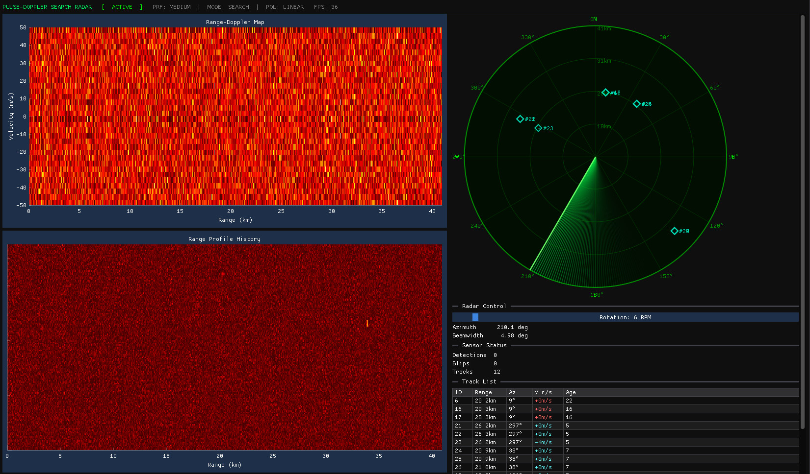

# RadarSim

A real-time C++ radar simulation with a full DSP pipeline: target physics, Range-Doppler processing, CA-CFAR detection, and multi-target tracking — all visualised in an interactive GUI.

---

## Screenshot



---

## Features

- **Physics-based target simulation** — targets fly 2D Cartesian paths with configurable speed, heading, and optional gradual manoeuvring; respawn at the radar edge when they leave coverage
- **Dual signal paths** — single-sweep CA-CFAR for the benchmark CLI, full CPI (32-pulse) Range-Doppler for the GUI
- **Range-Doppler processing** — Cooley-Tukey radix-2 FFT per range bin, magnitude map, fftshift, Doppler-to-velocity conversion
- **CA-CFAR detection** — O(N) sliding-window implementation with configurable guard cells, reference cells, and threshold multiplier
- **Multi-target tracker** — greedy nearest-neighbour association with range prediction, EMA smoothing (α = 0.3), and beam-gated miss counting
- **Real-time GUI** — Range-Doppler heatmap, waterfall history, PPI scope with colour-coded blips and a live track table; capped at 60 FPS

---

## Architecture

```
SimTarget physics
      ↓
SignalGenerator ──generate_cpi()──► CPI (32 × 1024 floats)
                                          ↓
                               SignalProcessor::process_cpi()
                               (FFT → RD map → CFAR)
                                          ↓
                                  vector<Detection>
                                          ↓
                               TargetTracker::update()
                                          ↓
                                   vector<Track>
                                          ↓
                                      GUI / PPI
```

The lock-free SPSC `RingBuffer<Sweep, 8>` is used by the CLI benchmark to decouple generator and processor threads. The GUI runs everything on a single thread per frame.

---

## Build

**Requirements:** CMake ≥ 3.16, a C++17 compiler (MSVC, GCC, or Clang), OpenGL.  
GLFW, Dear ImGui, and ImPlot are downloaded automatically by CMake on first configure.

```powershell
# Configure (downloads dependencies — internet required once)
cmake -S . -B build

# Build all three targets
cmake --build build --target radarsim
cmake --build build --target radarsim_gui
cmake --build build --target tests
```

---

## Running

```powershell
# GUI — real-time radar display
.\build\radarsim_gui.exe

# CLI benchmark — 10 000 sweeps, prints throughput and latency
.\build\radarsim.exe

# Test suite — prints "All tests passed." on success
.\build\tests.exe
```

---

## GUI Layout

| Panel | Contents |
|---|---|
| Left-top | Range-Doppler heatmap (km vs m/s, hot colormap) |
| Left-bottom | Waterfall — 150-row history of the first pulse |
| Right | PPI scope (polar), simulation controls, live track table |

Blip colour encodes radial velocity: green = slow, yellow = medium, red = fast.  
Blip lifetime scales with antenna rotation period (min 3 s, max 12 s).

---

## Key Constants

| Constant | Value | Meaning |
|---|---|---|
| `RANGE_BINS` | 1024 | Range resolution cells per sweep |
| `NUM_PULSES` | 32 | Pulses per CPI (must be power of two) |
| `MAX_VELOCITY` | 5.0 bins/CPI | Doppler ambiguity limit |
| `KM_PER_BIN` | 0.040 km | 40 m/bin → ~41 km max range |
| `MS_PER_VEL` | 10.0 m/s | Velocity scale for display |

---

## Project Structure

```
include/
  signal_generator.hpp   SimTarget struct + SignalGenerator class
  signal_processor.hpp   Detection struct + SignalProcessor class (CA-CFAR, FFT)
  target_tracker.hpp     Track struct + TargetTracker class
  ring_buffer.hpp        Lock-free SPSC ring buffer template
src/
  signal_generator.cpp
  signal_processor.cpp
  target_tracker.cpp
  main.cpp               CLI benchmark entry point
  main_gui.cpp           GUI entry point (Dear ImGui + ImPlot + GLFW)
tests/
  test_main.cpp          Four assert-based unit tests, no framework
```
